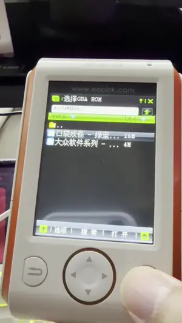

[](https://github.com/HelloClyde/gba-for9588/actions/workflows/build.yml)
[](https://github.com/HelloClyde/gba-for9588/releases/latest)
[](LICENSE)

基于 [libretro/gpSP](https://github.com/libretro/gpsp) 的 BBK 9588 原生 GBA 模拟器。
项目使用 MIPS 动态重编译器，通过 [BBK 9588 BDA SDK](sdk/) 构建为独立 `GBA.bda`。

> 当前仍是测试版本。模拟器和真机均已完成 ROM 加载、画面、声音、触摸控制、换 ROM 与
> 存档恢复验证；触摸延迟和长时间真机稳定性仍在继续测试。

## 下载

从 [GitHub Releases](https://github.com/HelloClyde/gba-for9588/releases/latest) 下载最新版本，
或直接下载 [GBA.bda](https://github.com/HelloClyde/gba-for9588/releases/latest/download/GBA.bda)。
发布页同时提供 `GBA.bda.sha256` 校验文件。

## 真机演示

<p align="center">
  <a href="https://github.com/HelloClyde/gba-for9588/releases/download/v0.1.0/GBA-for-BBK9588-demo.mp4">
    
  </a>
</p>

点击动态预览观看完整的 43 秒真机演示，内容包括选择 ROM、启动游戏、触摸控制和实际运行。
完整视频采用 H.264/AAC 编码，大小约 3.8 MB，也可从
[v0.1.0 Release](https://github.com/HelloClyde/gba-for9588/releases/tag/v0.1.0) 下载。

## 功能

- gpSP MIPS32 dynamic recompiler，以及便于诊断的解释器目标
- GBA 59.7275 Hz 逻辑时序，默认约 30 FPS，触摸控制栏可切换 20/30/60 FPS 画面输出
- 22050 Hz 单声道 PCM；短按扬声器静音/恢复，长按切换 100/75/50/25% 音量
- 帧率、音量与实体键映射使用 CRC 校验的 A/B 双槽配置，在正常退出时持久化
- `AB/BA` 按钮可交换实体 Enter/Escape 的短按 A/B 映射，长按 Escape 始终退出
- 从 `A:\GAMEBOY\` 选择 `.gba` ROM
- SRAM、Flash、EEPROM 以及带 CRC 的 A/B 双槽存档
- 子帧 raw 触摸、单包实体键采样、帮助页和运行中切换 ROM
- 适配 16 MiB/32 MiB ROM 的 32 KiB 分页读取

## 性能优化

移植版保持 GBA 核心 `59.7275 Hz` 的逻辑时序，不把游戏逻辑降到 30 FPS；约 30 FPS 仅指
屏幕提交频率。当前主要采用以下优化：

- **MIPS32 动态重编译**：启用 gpSP MIPS dynarec，使用可执行 JIT 缓冲区和 32 字节粒度的
  D-cache 写回/I-cache 失效，避免逐条解释 ARM 指令；缩小 translation cache 与 ROM branch
  hash，以适应 9588 的可用内存。固件 IRQ 只在恢复完整宿主 `$gp/$s0-$s7/$fp/$ra` 后开放，
  核心回调与运行期 ROM page I/O 都通过宿主安全包装器执行；raw 触摸和实体键采集移到完整
  GBA 帧的宿主边界，避免 SDK 输入调用与 guest 寄存器上下文交叉；translation cache 达到
  75% 时只在帧边界同时回收 ROM/RAM JIT，避免深层翻译期间回卷。
- **按需读取 ROM**：不把 16 MiB/32 MiB ROM 整体装入内存。默认使用 2 MiB ROM cache，
  miss 时按 32 KiB 页面读取并替换。4 MiB cache 已在真机出现死机，因此正式版和构建脚本
  都固定为 2 MiB，不再提供 4 MiB 变体。
- **逻辑帧与显示帧解耦**：默认 `frameskip=1`，核心仍执行约 59.7 帧/秒，只提交约 30 帧/秒；
  顶部数字按钮可在 `frameskip=0/1/2` 间切换，对应约 60/30/20 FPS，切换不会降低 GBA
  逻辑速度。画面以原生 `240x160 RGB565` 路径输出，不做缩放、色彩校正或帧混合。触摸
  控制层仅在按键、声音或帧率状态变化时重绘，重绘时直接覆盖背景，不再先对 76.8 KiB
  像素缓冲区做一次冗余清零。
- **分块 PCM 流水线**：将 gpSP 的 65536 Hz 立体声降采样为 22050 Hz 单声道，使用 4096
  sample 环形缓冲区和 512 sample 硬件写块。降采样直接累计左右声道，4-sample 窗口用移位、
  6-sample 窗口用带校正的定点倒数完成精确平均，不在热路径执行整数除法；正常播放直接
  提交 ring 中连续块，不再逐样本复制到中间缓冲。PCM 服务与输入采样分离，并对背压等待
  设置上限，避免音频队列反向放大输入轮询频率。
- **自管输入**：游戏运行阶段不使用 Window Timer 或窗口消息泵。每个完整 GBA 帧读取最多
  8 条 raw 触摸事件，并只读取一次 6-byte 实体键状态包；
  同批 MOVE 只读取一次最新坐标，控制层只在命中状态变化时重绘；
  输入采集与 KEYINPUT 更新在同一宿主边界完成，按键 IRQ 在重新进入 `update_gba()` 后统一提升，
  不受固件 25 ms tick 限制。
- **移出热循环的 I/O**：普通性能日志低频记录，诊断构建可临时提高采样频率；运行中不周期扫描或写入
  128 KiB 存档；正式版每 600 帧记录一次运行统计，避免约每 2 秒同步开关日志文件。游戏存档
  只在换 ROM 和正常退出时 checkpoint，并通过 CRC 跳过未变化的写入。
- **可关闭的阶段剖析**：R44 在宿主安全边界只读 CP0 Count，分别累计核心、视频提交、音频重采样、
  PCM 服务、ROM 分页和控制层提交耗时，不启用固件 timer，也不改变 IRQ 策略。运行日志中的
  `perf_*_pm` 是统计区间内的千分比，`perf_c25` 是每个 25 ms tick 对应的 Count 增量；
  `perf_run_pm` 包含核心回调，`perf_cpu_pm` 是扣除嵌套回调后的近似 CPU 占用。周期日志关闭时仅在
  正常退出汇总整个运行区间。
- **面向小内存的构建**：使用 `-Os`、独立函数/数据 section、链接期 `--gc-sections` 和精简
  translation cache，减少 BDA、JIT 元数据和常驻内存占用。

在 9588 模拟器对 16 MiB Emerald ROM 的 12000 帧回归中，稳定区间为 `59.70-59.85`
逻辑 FPS、`29.85-29.92` 显示 FPS 和 `22040-22095 Hz` 音频生成率；视频提交、音频短写、
丢弃和背压超时均为 0。该数据用于回归比较，真机表现仍会受 ROM、固件版本和触摸事件负载
影响。

## 构建

环境要求：Windows、PowerShell、Git 和 Python 3.10 或更高版本。首次构建会下载固定版本的
gpSP、公开测试 ROM 源以及经过 SHA-256 校验的 MIPS 交叉工具链。

```powershell
git submodule update --init sdk
.\tools\build.ps1 -Target gpsp_app
```

输出文件：`build\gpsp_app\GBA.bda`。

默认发布构建使用 `-Os`。性能对比可显式生成独立目录，不覆盖默认产物：

```powershell
.\tools\build.ps1 -Target gpsp_app -Optimization O2
.\tools\build.ps1 -Target gpsp_app -Optimization O3 -Lto
.\tools\build.ps1 -Target gpsp_app -RuntimeLogIntervalFrames 0
```

对应变体写入 `build\gpsp_app-O2\`、`build\gpsp_app-O3-lto\`、
`build\gpsp_app-logoff\`。关闭周期日志的包仍记录首帧与正常退出
汇总；未经真机稳定性和速度对比的变体不会成为默认发布配置。

只初始化依赖而不下载工具链：

```powershell
.\tools\bootstrap.ps1 -SkipToolchain
```

## 安装与使用

1. 将 `GBA.bda` 放入设备应用程序目录。
2. 将合法持有的 `.gba` 文件放入 `A:\GAMEBOY\`。
3. 启动 `GBA`，从系统文件选择器打开 ROM。
4. 顶部 `30/20/60` 数字按钮切换画面帧率；短按扬声器静音/恢复，长按约 0.5 秒在
   100/75/50/25% 音量间循环；中部 `AB/BA` 按钮交换两个实体动作键的短按映射。
5. 长按实体退出键返回系统菜单；退出和换 ROM 时会刷新存档，正常退出时保存前端配置。

仓库和发布包不包含商业 ROM、Nintendo BIOS、BBK 固件、NAND 镜像或模拟器数据。

## 测试

校验公开的 MIT 许可 GBA 测试 ROM：

```powershell
.\tools\bootstrap.ps1 -SkipToolchain
.\tools\verify_public_test_roms.ps1
```

已安装 9588 模拟器时，可运行公开 ROM 的 120 帧 DRC headless 冒烟回归并自动导出日志：

```powershell
.\tools\test_public_roms_in_emulator.ps1 -ResetImage
```

私有 ROM 测试只读取被 Git 忽略的本地配置，配置方法见
[tests/roms/README.md](tests/roms/README.md)。公开回归固定经过人工检查的最终画面、整段视频、
PC 和 CPSR 签名，用于发现 DRC 行为漂移；它仍以 gpSP 当前行为为兼容基线，模拟器通过也不能
替代独立参考实现的正确性结论或真机性能和稳定性验证。

## 构建目标

| 目标 | 用途 |
|---|---|
| `gpsp_app` | 正式 DRC 应用，输出 `GBA.bda` |
| `gpsp_app_interpreter` | 解释器对照版本 |
| `gpsp_app_cpu_test` | CPU/输入调度诊断版本 |
| `gpsp_headless` | 无窗口 gpSP 冒烟测试 |
| `gpsp_headless_patched` | 使用 BBK 补丁但关闭 DRC 的差异定位版本 |
| `gpsp_dynarec` | 无窗口 DRC 冒烟测试 |
| `m0_smoke`、`m1_runtime`、`m1_av`、`m6_save` | SDK、运行时、音视频与存档探针 |

## 目录

```text
sdk/                    BBK 9588 SDK Git submodule
src/app/                BDA 主程序与 gpSP frontend
src/platform/bbk9588/   文件、音频、存档、cache 与 JIT 平台层
src/ui/                 触摸控制层
third_party/patches/    固定 gpSP 版本上的移植补丁
tests/                  BDA 探针和 ROM fixture 清单
tools/                  依赖初始化、构建、打包与校验脚本
plan.md                 移植过程、验证数据和后续计划
```

## 鸣谢

- gpSP 原作者 Exophase，以及 libretro/gpSP 维护者
- BBK 9588 SDK 与 9x88 移植：HelloClyde

## 许可证

本仓库中的 gpSP 派生补丁和 9588 移植代码按 [GNU GPL v2](LICENSE) 发布。
`sdk` submodule、gpSP 和测试依赖保留各自许可证；详见
[NOTICE.md](NOTICE.md) 与 [third_party/UPSTREAM.md](third_party/UPSTREAM.md)。
