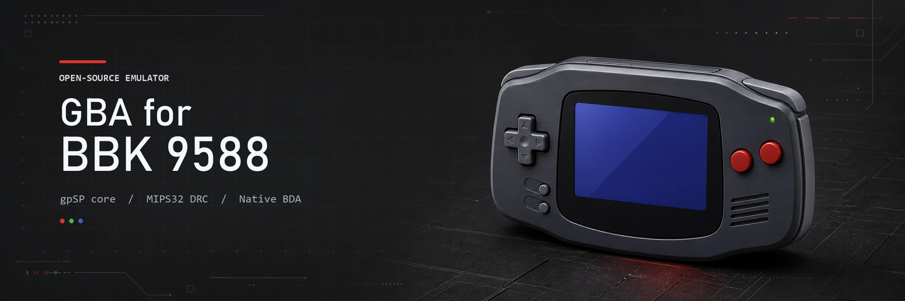

[](https://github.com/HelloClyde/gba-for9588/actions/workflows/build.yml)
[](https://github.com/HelloClyde/gba-for9588/releases/latest)
[](LICENSE)

基于 [libretro/gpSP](https://github.com/libretro/gpsp) 的 BBK 9588 原生 GBA 模拟器。
项目使用 MIPS 动态重编译器，通过 [BBK 9588 BDA SDK](sdk/) 构建为独立 `GBA.bda`。

> 当前仍是测试版本。模拟器和真机均已完成 ROM 加载、画面、声音、触摸控制、换 ROM 与
> 存档恢复验证；触摸延迟和长时间真机稳定性仍在继续测试。

## 下载

从 [GitHub Releases](https://github.com/HelloClyde/gba-for9588/releases/latest) 下载最新版本，
或直接下载 [GBA.bda](https://github.com/HelloClyde/gba-for9588/releases/latest/download/GBA.bda)。
发布页同时提供 `GBA.bda.sha256` 校验文件。

## 功能

- gpSP MIPS32 dynamic recompiler，以及便于诊断的解释器目标
- GBA 59.7275 Hz 逻辑时序，默认约 30 FPS 画面输出
- 22050 Hz 单声道 PCM，声音默认开启且可在触摸控制栏切换
- 从 `A:\GAMEBOY\` 选择 `.gba` ROM
- SRAM、Flash、EEPROM 以及带 CRC 的 A/B 双槽存档
- 触摸屏 GBA 按键、实体方向键、帮助页和运行中切换 ROM
- 适配 16 MiB/32 MiB ROM 的 32 KiB 分页读取

## 构建

环境要求：Windows、PowerShell、Git 和 Python 3.10 或更高版本。首次构建会下载固定版本的
gpSP、公开测试 ROM 源以及经过 SHA-256 校验的 MIPS 交叉工具链。

```powershell
git submodule update --init sdk
.\tools\build.ps1 -Target gpsp_app
```

输出文件：`build\gpsp_app\GBA.bda`。

只初始化依赖而不下载工具链：

```powershell
.\tools\bootstrap.ps1 -SkipToolchain
```

## 安装与使用

1. 将 `GBA.bda` 放入设备应用程序目录。
2. 将合法持有的 `.gba` 文件放入 `A:\GAMEBOY\`。
3. 启动 `GBA`，从系统文件选择器打开 ROM。
4. 长按实体退出键返回系统菜单；退出和换 ROM 时会刷新存档。

仓库和发布包不包含商业 ROM、Nintendo BIOS、BBK 固件、NAND 镜像或模拟器数据。

## 测试

校验公开的 MIT 许可 GBA 测试 ROM：

```powershell
.\tools\bootstrap.ps1 -SkipToolchain
.\tools\verify_public_test_roms.ps1
```

私有 ROM 测试只读取被 Git 忽略的本地配置，配置方法见
[tests/roms/README.md](tests/roms/README.md)。模拟器通过不能替代真机性能和稳定性验证。

## 构建目标

| 目标 | 用途 |
|---|---|
| `gpsp_app` | 正式 DRC 应用，输出 `GBA.bda` |
| `gpsp_app_interpreter` | 解释器对照版本 |
| `gpsp_app_cpu_test` | CPU/事件调度诊断版本 |
| `gpsp_headless` | 无窗口 gpSP 冒烟测试 |
| `gpsp_dynarec` | 无窗口 DRC 冒烟测试 |
| `m0_smoke`、`m1_runtime`、`m1_av`、`m6_save` | SDK、运行时、音视频与存档探针 |

## 目录

```text
sdk/                    BBK 9588 SDK Git submodule
src/app/                BDA 主程序与 gpSP frontend
src/platform/bbk9588/   文件、音频、存档、cache 与 JIT 平台层
src/ui/                 触摸控制层
third_party/patches/    固定 gpSP 版本上的移植补丁
tests/                  BDA 探针和 ROM fixture 清单
tools/                  依赖初始化、构建、打包与校验脚本
plan.md                 移植过程、验证数据和后续计划
```

## 鸣谢

- gpSP 原作者 Exophase，以及 libretro/gpSP 维护者
- BBK 9588 SDK 与 9x88 移植：HelloClyde

## 许可证

本仓库中的 gpSP 派生补丁和 9588 移植代码按 [GNU GPL v2](LICENSE) 发布。
`sdk` submodule、gpSP 和测试依赖保留各自许可证；详见
[NOTICE.md](NOTICE.md) 与 [third_party/UPSTREAM.md](third_party/UPSTREAM.md)。
